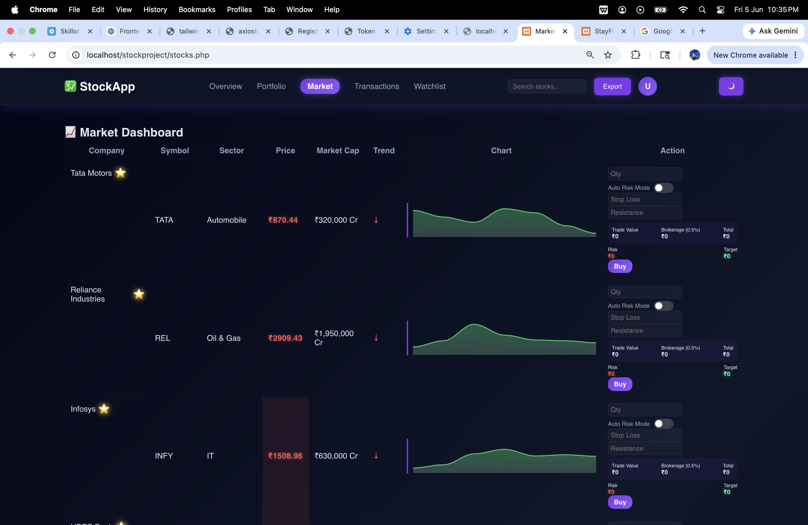
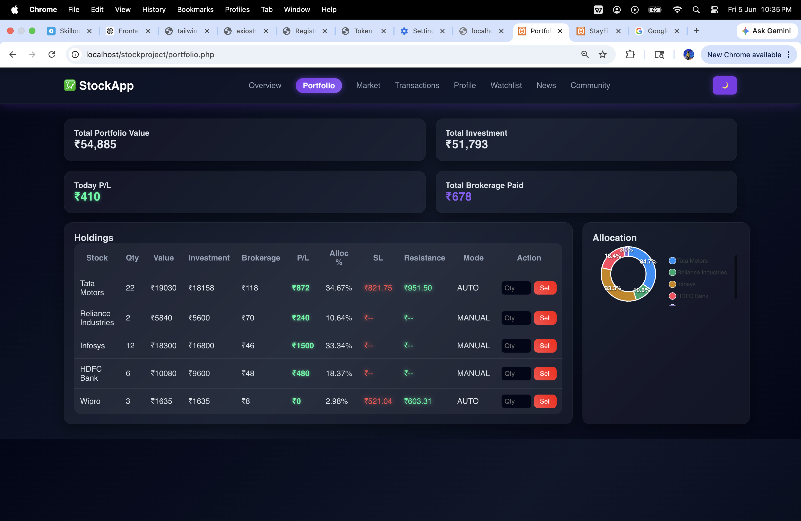
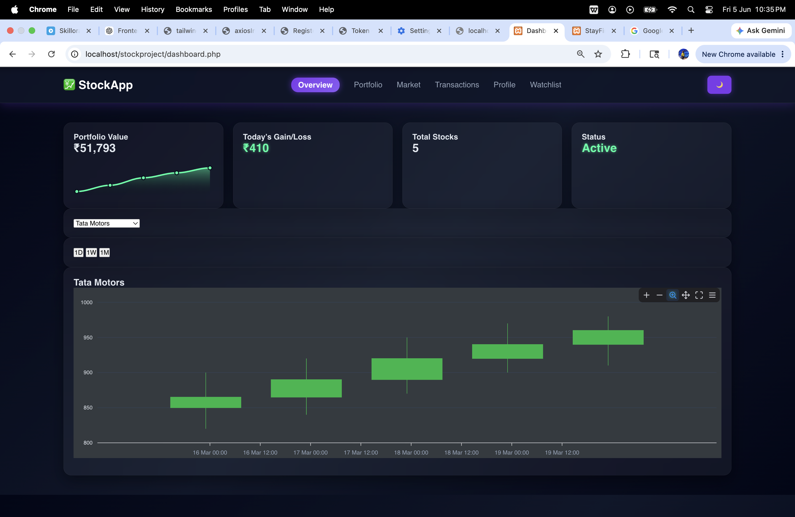

# 📈 StockPilot

<div align="center">

# Real-Time Stock Portfolio Management System

Track • Trade • Analyze • Grow


</div>

---

## 🚀 About The Project

**StockPilot** is a web-based Stock Portfolio Management System that simulates real-world stock trading and investment tracking.

The platform allows users to monitor stock prices, manage portfolios, execute buy and sell transactions, analyze market trends, and maintain a complete history of trading activities.

Designed to replicate realistic trading scenarios, StockPilot helps users understand portfolio management, stock market behavior, and investment decision-making through an intuitive and interactive interface.

---

## ✨ Key Features

### 📊 Market Dashboard
- View available stocks and market data
- Track current stock prices
- Explore company information
- Monitor sector-wise performance

### 💰 Trading Simulation
- Buy stocks using virtual balance
- Sell owned stocks instantly
- Automatic portfolio updates
- Real-time balance management

### 💼 Portfolio Management
- Track investments efficiently
- View portfolio holdings
- Monitor gains and losses
- Analyze portfolio performance

### 📈 Market Analytics
- Historical stock price tracking
- Trend analysis
- Interactive visualizations
- Performance insights

### ⭐ Personalized Watchlist
- Save favorite stocks
- Monitor selected companies
- Quick access to important assets

### 📜 Transaction History
- Complete trading records
- Buy and sell logs
- Activity tracking
- Investment audit trail

---

## 🏗️ System Architecture

```text
                ┌─────────────┐
                │    User     │
                └──────┬──────┘
                       │
                       ▼
             ┌──────────────────┐
             │   Web Interface  │
             └────────┬─────────┘
                      │
                      ▼
         ┌───────────────────────────┐
         │     Application Layer     │
         ├───────────────────────────┤
         │  Stock Management Module  │
         │  Portfolio Module         │
         │  Trading Engine           │
         │  Analytics Module         │
         │  Watchlist Module         │
         └─────────────┬─────────────┘
                       │
                       ▼
               ┌──────────────┐
               │   Database   │
               └──────────────┘
```

---

## 🗄️ Database Components

| Module | Description |
|----------|-------------|
| Stocks | Stores stock information and prices |
| Users | User account details |
| Portfolio | User investment holdings |
| Transactions | Buy and sell records |
| Watchlist | User saved stocks |
| Historical Data | Stores price history |

---

## 🛠️ Technology Stack

### Frontend
- HTML5
- CSS3
- JavaScript

### Backend
- Python

### Database
- SQLite / MySQL

### Data Visualization
- Matplotlib
- Chart.js

---

## 📸 Project Screenshots

### Dashboard



### Portfolio Management



### Market Analytics



---

## 🎯 Objectives

- Simulate real-world stock market trading
- Enable efficient portfolio management
- Track investment performance
- Provide market trend analysis
- Maintain accurate transaction records
- Enhance financial decision-making skills

---

## 🔮 Future Enhancements

- Real-time stock market API integration
- AI-based stock prediction
- Risk analysis system
- News sentiment analysis
- Advanced portfolio recommendations
- Mobile application support

---

## 👩‍💻 Developed By

**Roshini Malhotra**

Stock Market Portfolio Management System developed for academic and learning purposes.

---

<div align="center">

### ⭐ Star this repository if you found it useful!

📈 Happy Investing 🚀

</div>
